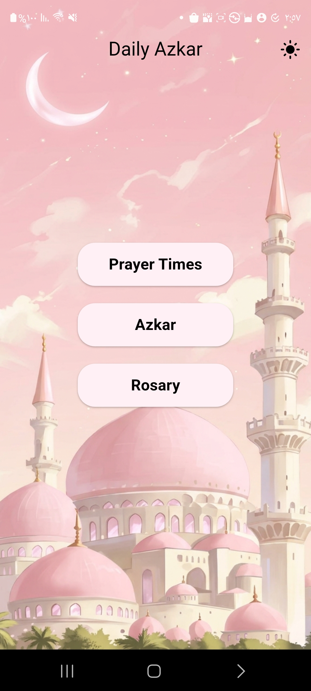
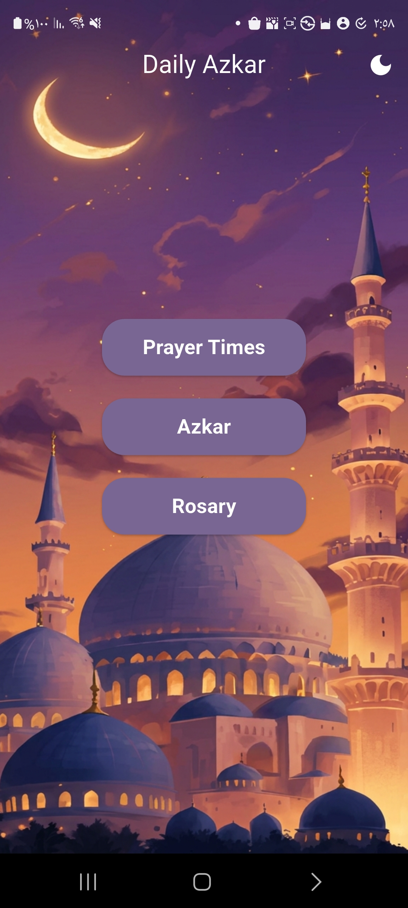
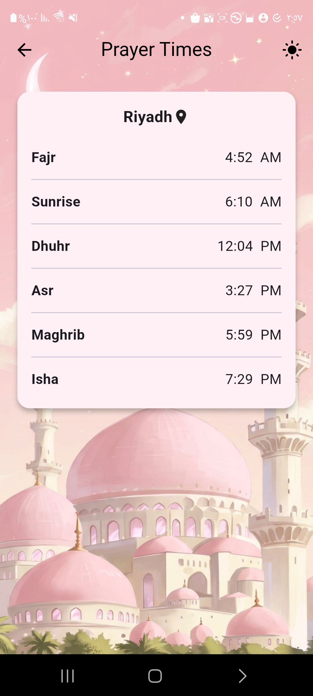
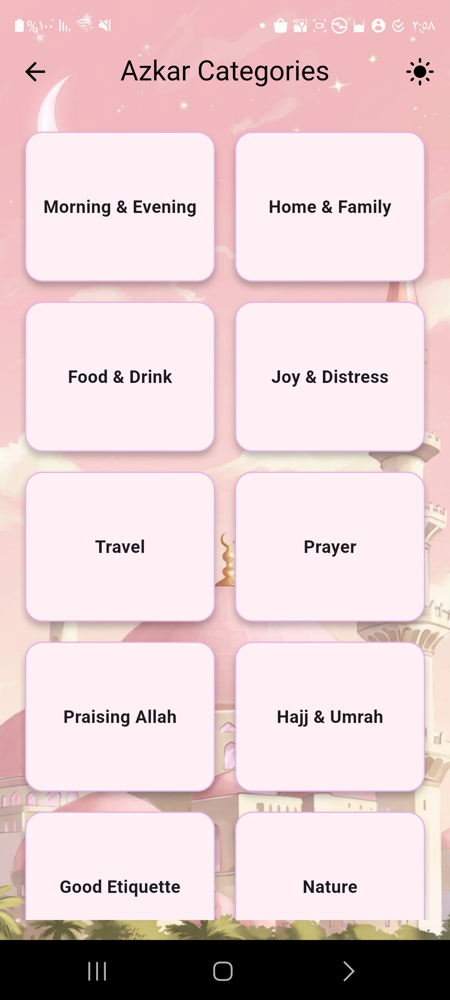
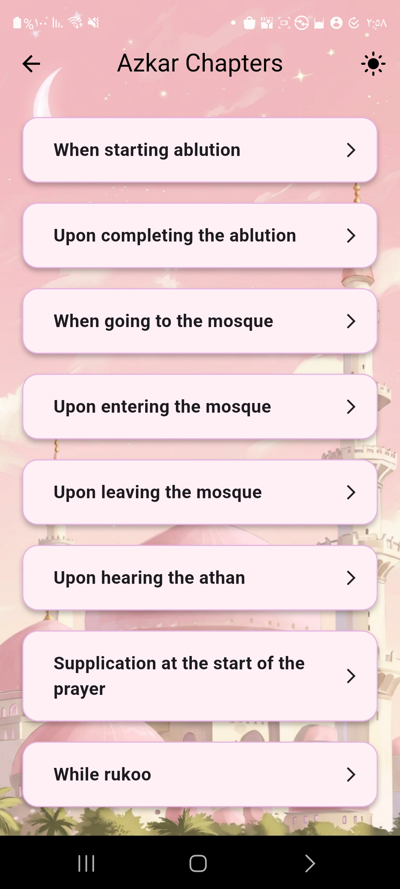
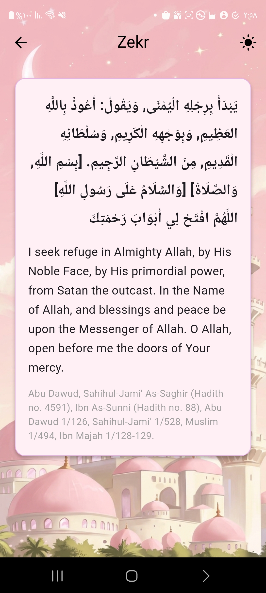
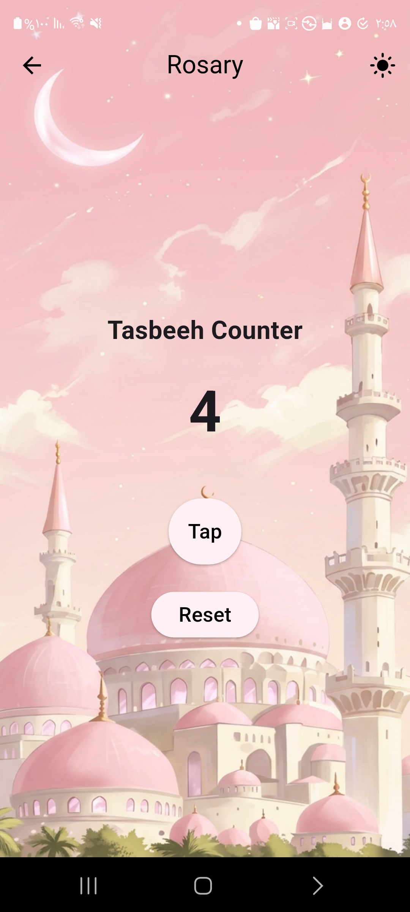

# Daily Azkar 🕌✨

A Flutter app to display daily Azkar, a Tasbeeh counter, and prayer times with clean UI and state management.  

---

## 📌 Project Overview 📖

Project Name: Daily Azkar  

This app provides:  
- 🏠 Home Screen: Access to Azkar categories, Rosary counter, and Prayer Times  
- 📚 Azkar Categories: Tap to view chapters and read each Zekr  
- 🔹 Rosary (Tasbeeh) Screen: Increment and reset counter  
- 🕰️ Prayer Times Screen: Displays daily prayer times in a scrollable card  
- 🌗 Dark/Light Mode: Toggle via Bloc  
- 🎨 Custom app icon: Added from external image  

---

## 📦 Packages Used 📌

-  bloc  
-  flutter_bloc  
-  go_router  
-  muslim_data_flutter   
-  flutter_launcher_icons  

---

## 📸 Screenshots & 🎥 Video

Here are some screenshots and a short demo video of the application:  

| Home Screen & Light Mode | Dark Mode | Prayer Times | Azkar Categories |
|--------------------------|-----------|--------------|-----------------|
|  |  |  |  |

| Azkar Chapters | Azkar Items | Rosary Counter |
|----------------|-------------|----------------|
|  |  |  |

---

- 🎬 Demo Video: Quick overview of app functionality

https://github.com/user-attachments/assets/a222c8d4-5f06-4130-9010-c410aa71f7f3

  
---

## ⚙️ Setup & Installation
1. Clone the repository: `git clone https://github.com/manhal203/flutter-daily-azkar.git`
2. Install dependencies: `flutter pub get`
3. Run the app: `flutter run`
